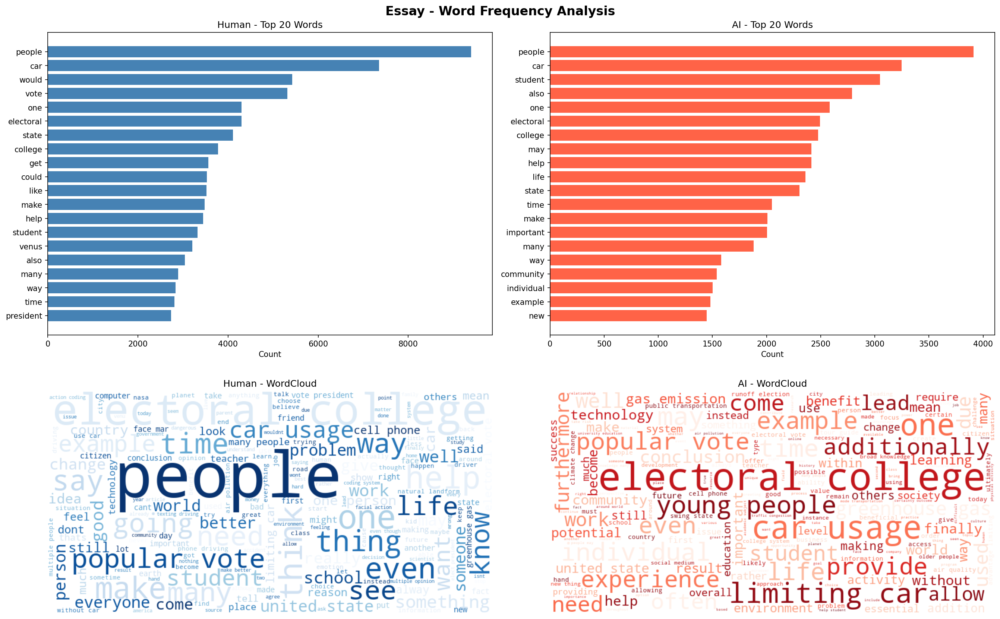
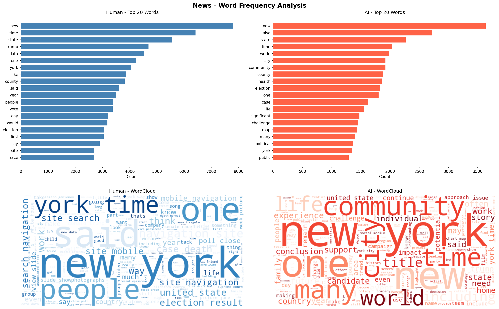
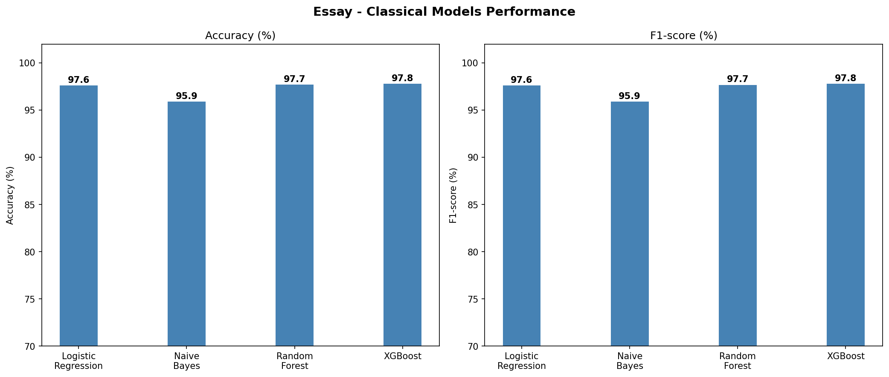
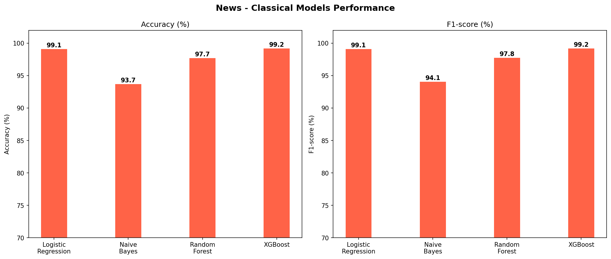
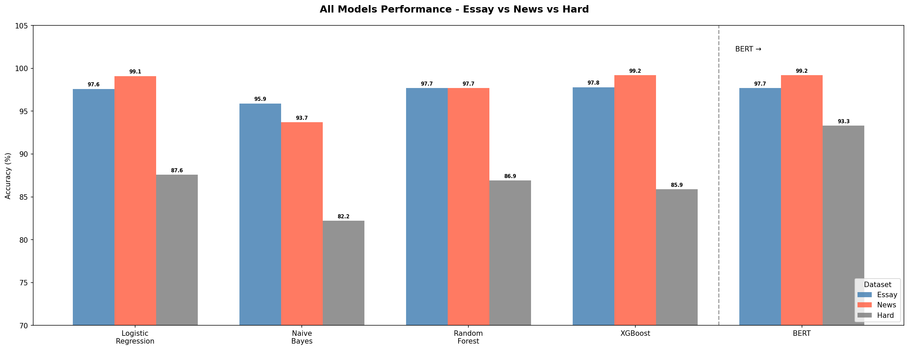
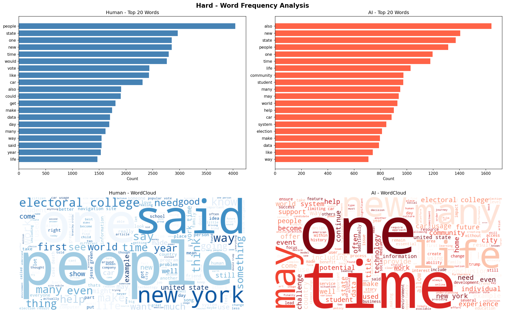
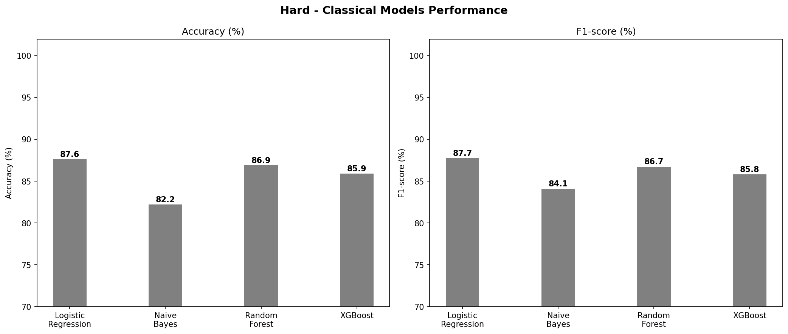

# AI-X_ai-generated-text-detection

## Title: AI 생성 콘텐츠 탐지 모델 비교 분석  
### AI 글·뉴스를 머신러닝으로 구분할 수 있을까?


## Members and Team Contribution
```
김희연, 2023073081
손승한, 2024020891
우지욱, 2023025969
임준형, 
```

본 프로젝트에서는 GitHub 블로그 작성과 설명 정리에 생성형 AI 도구를 일부 활용하였다. 그러나 코드, 알고리즘, 실험 설계, 결과 해석은 팀원들이 직접 검토하고 이해한 내용을 바탕으로 정리하였다.

특히 단순히 결과를 제시하는 것이 아니라, 왜 해당 전처리 과정을 적용했는지, 왜 특정 알고리즘을 선택했는지, 왜 Accuracy와 F1-score를 함께 사용했는지, 그리고 Essay, News, Hard dataset을 각각 어떻게 해석해야 하는지를 팀원별로 나누어 설명하였다.


## Project Overview

최근 ChatGPT와 같은 생성형 AI가 글쓰기, 뉴스 작성, 과제물 작성 등 다양한 영역에서 활용되면서 AI가 작성한 텍스트와 사람이 작성한 텍스트를 구분하는 문제가 중요해지고 있다.

본 프로젝트는 AI-generated text와 human-written text를 구분하는 머신러닝 모델을 구현하고, Essay와 News라는 서로 다른 장르에서 AI 탐지 모델이 얼마나 안정적으로 작동하는지 비교하는 것을 목표로 한다.

특히 Essay와 News 데이터는 문체적 특성이 다르기 때문에, 두 데이터를 하나로 합치지 않고 각각 독립적인 분류 문제로 설계하였다.


## Research Questions

본 프로젝트에서 다루는 주요 연구 질문은 다음과 같다.

1. TF-IDF 기반 머신러닝 모델은 Essay 데이터에서 AI 생성 텍스트를 효과적으로 탐지할 수 있는가?
2. 같은 방식의 모델은 News 데이터에서도 안정적으로 작동하는가?
3. Essay와 News 중 어떤 장르에서 AI 탐지가 더 쉬운가?
4. 장르에 따라 가장 적합한 분류 알고리즘은 달라지는가?
5. 고전 머신러닝 모델과 BERT 기반 모델의 성능 차이는 어떻게 나타나는가?


## Dataset

본 프로젝트에서는 Essay와 News 데이터를 중심 데이터셋으로 사용하였다. 각 데이터셋은 사람이 작성한 텍스트와 AI가 생성한 텍스트로 구성되어 있다.

| Dataset | Human-written | AI-generated | Total | Usage |
|---|---:|---:|---:|---|
| Essay | 2,500 | 2,500 | 5,000 | Main Experiment |
| News | 2,500 | 2,500 | 5,000 | Main Experiment |
| Hard | - | - | - | Additional Experiment |

Label은 다음과 같이 정의하였다.

| Label | Meaning |
|---|---|
| 0 | Human-written text |
| 1 | AI-generated text |

Essay와 News 데이터는 장르별 AI 탐지 성능을 비교하기 위한 핵심 데이터셋으로 사용하였다.  
Hard dataset은 모델이 더 어려운 조건에서도 안정적으로 작동하는지 확인하기 위한 추가 실험 데이터셋으로 활용하였다.

## Project Design

Essay와 News는 서로 다른 문체적 특징을 가진다.

Essay는 개인의 경험, 주장, 감정 표현, 연결어 사용 등이 많이 나타나는 반면, News는 객관적이고 형식적인 문장 구조를 가지는 경우가 많다. 따라서 두 데이터를 하나로 합쳐 학습할 경우, 모델이 AI 여부가 아니라 장르 차이를 학습할 가능성이 있다.

이를 방지하기 위해 본 프로젝트에서는 Essay AI Detection Model과 News AI Detection Model을 별도로 설계하였다. 각 데이터셋에 동일한 전처리 및 모델링 절차를 적용한 뒤, 장르별 성능 차이를 비교하였다.


## Methodology

전체 분석 과정은 다음과 같다.

1. Dataset loading
2. Text preprocessing
3. Word frequency analysis
4. TF-IDF vectorization
5. Classical machine learning model training
6. BERT-based model training
7. Model performance comparison
8. Result visualization


## Text Preprocessing

텍스트 데이터는 모델 학습에 적합하도록 다음과 같은 전처리 과정을 거쳤다.

- 결측치 제거
- Label 값 정리
- 소문자 변환
- 특수문자 제거
- 불용어 제거
- Lemmatization
- 너무 짧은 텍스트 제거

전처리 후 생성된 텍스트는 `clean_text` 컬럼에 저장하였다.

## Models

본 프로젝트에서는 고전 머신러닝 모델과 BERT 기반 모델을 함께 사용하였다.

```
Classical Machine Learning Models

- Logistic Regression
- Naive Bayes
- Random Forest
- XGBoost

Transformer-based Model

- DistilBERT

고전 머신러닝 모델은 TF-IDF로 변환된 텍스트 벡터를 입력으로 사용하였다.  
BERT 모델은 문맥 정보를 반영할 수 있는 Transformer 기반 모델로, 단어 빈도 중심의 고전 모델과 비교하기 위해 사용하였다.
```

## Evaluation Metrics

모델 성능은 다음 지표를 기준으로 평가하였다.

| Metric | Description |
|---|---|
| Accuracy | 전체 데이터 중 모델이 올바르게 예측한 비율 |
| F1-score | Precision과 Recall의 균형을 고려한 성능 지표 |

Accuracy는 전체적인 분류 정확도를 보여주고, F1-score는 AI 텍스트와 Human 텍스트를 균형 있게 분류하는지 확인하는 데 사용하였다.

## Results

최종 실험 결과는 다음과 같다.

| Model | Essay | News | Hard |
|---|---:|---:|---:|
| Logistic Regression | 97.6% | 99.1% | 87.6% |
| Naive Bayes | 95.9% | 93.7% | 82.2% |
| Random Forest | 97.7% | 97.7% | 86.9% |
| XGBoost | 97.8% | 99.2% | 85.9% |
| BERT | 97.7% | 99.2% | 93.3% |

Essay와 News 데이터에서는 대부분의 모델이 높은 성능을 보였다. 특히 News 데이터에서는 Logistic Regression, XGBoost, BERT가 모두 높은 정확도를 보였다.

Hard dataset에서는 고전 머신러닝 모델의 성능이 상대적으로 낮아졌지만, BERT는 93.3%의 정확도를 보여 더 어려운 데이터에서 강점을 보였다.


## Visualization

### Word Frequency Analysis

Essay와 News 데이터에서 Human-written text와 AI-generated text의 단어 사용 패턴을 비교하였다.





### Classical Model Performance

각 데이터셋에 대해 고전 머신러닝 모델의 Accuracy와 F1-score를 비교하였다.





### Final Model Comparison

고전 머신러닝 모델과 BERT 모델의 성능을 최종 비교하였다.




## Repository Structure

```text
AI-X_ai-generated-text-detection/
├── README.md
├── data/
│   ├── README.md
│   ├── project_dataset/
│   │   ├── essay_dataset.csv
│   │   ├── news_dataset.csv
│   │   └── hard_dataset.csv
│   └── processed/
│       ├── essay_clean_dataset.csv
│       └── news_clean_dataset.csv
├── notebooks/
│   ├── README.md
│   └── human_vs_ai_text_classification.py
├── results/
│   ├── figures/
│   │   ├── essay_words.png
│   │   ├── news_words.png
│   │   ├── hard_words.png
│   │   ├── essay_classical.png
│   │   ├── news_classical.png
│   │   ├── hard_classical.png
│   │   └── final_all_models.png
│   └── tables/
│       └── final_results.csv
├── src/
└── requirements.txt
```

## How to Run

프로젝트 실행을 위해 먼저 필요한 라이브러리를 설치한다.

```bash
pip install -r requirements.txt
```

그다음 메인 Python 파일을 실행한다.

```bash
python notebooks/human_vs_ai_text_classification.py
```

메인 코드는 Essay, News, Hard dataset을 불러와 전처리, 시각화, 모델 학습, 성능 비교를 순서대로 수행한다.


## Expected Output

코드를 실행하면 전처리된 데이터, 시각화 이미지, 최종 결과표가 생성된다.

```text
data/
└── processed/
    ├── essay_clean_dataset.csv
    ├── news_clean_dataset.csv
    └── hard_clean_dataset.csv

results/
├── figures/
│   ├── essay_words.png
│   ├── news_words.png
│   ├── hard_words.png
│   ├── essay_classical.png
│   ├── news_classical.png
│   ├── hard_classical.png
│   └── final_all_models.png
└── tables/
    └── final_results.csv
```

일부 전처리 데이터 파일은 용량 제한으로 인해 GitHub에 업로드하지 않을 수 있다. 이 경우에도 메인 코드를 실행하면 동일한 파일을 다시 생성할 수 있다.


## Results Summary

본 프로젝트의 실험은 크게 두 가지로 구성된다.

첫 번째는 Essay와 News 데이터를 활용한 main experiment이다.  
두 번째는 더 어려운 조건의 Hard dataset을 활용한 additional experiment이다.

### Main Experiment: Essay vs News

Essay와 News 데이터에 대해 각각 독립적인 AI text detection model을 학습하였다. 두 데이터셋은 하나로 합치지 않고, 장르별 특성을 비교하기 위해 따로 분석하였다.

| Model | Essay Accuracy | News Accuracy |
|---|---:|---:|
| Logistic Regression | 97.6% | 99.1% |
| Naive Bayes | 95.9% | 93.7% |
| Random Forest | 97.7% | 97.7% |
| XGBoost | 97.8% | 99.2% |
| BERT | 97.7% | 99.2% |

Essay와 News 데이터에서는 대부분의 모델이 높은 성능을 보였다. 특히 News 데이터에서는 XGBoost와 BERT가 99.2%의 정확도를 기록하며 가장 높은 성능을 보였다.

### Additional Experiment: Hard Dataset

Hard dataset은 Essay와 News 중심의 main experiment와 별도로 사용하였다. 이 실험은 더 어려운 텍스트 환경에서 고전 머신러닝 모델과 BERT 기반 모델의 성능 차이를 확인하기 위한 additional experiment이다.

| Model | Hard Accuracy |
|---|---:|
| Logistic Regression | 87.6% |
| Naive Bayes | 82.2% |
| Random Forest | 86.9% |
| XGBoost | 85.9% |
| BERT | 93.3% |

Hard dataset에서는 고전 머신러닝 모델의 성능이 Essay와 News에 비해 낮아졌다. 반면 BERT는 93.3%의 정확도를 보여, 더 어려운 데이터 환경에서 문맥 정보를 반영하는 Transformer 기반 모델의 강점이 나타났다.


## Visualization

### Word Frequency Analysis

Human-written text와 AI-generated text에서 자주 등장하는 단어를 비교하였다.

#### Essay Dataset


#### News Dataset


#### Hard Dataset




### Classical Model Performance

각 데이터셋에 대해 TF-IDF 기반 고전 머신러닝 모델의 Accuracy와 F1-score를 비교하였다.

#### Essay Dataset


#### News Dataset


#### Hard Dataset




### Final Model Comparison

Essay, News, Hard dataset에 대해 고전 머신러닝 모델과 BERT 모델의 성능을 최종 비교하였다.


## Conclusion

본 프로젝트는 AI-generated text와 human-written text를 분류하는 모델을 구현하고, Essay와 News라는 서로 다른 장르에서 AI 탐지 모델의 성능을 비교하였다.

Main experiment에서는 Essay와 News 데이터를 각각 독립적으로 학습하여 장르별 성능 차이를 확인하였다. 실험 결과, TF-IDF 기반 고전 머신러닝 모델만으로도 Essay와 News 데이터에서 높은 탐지 성능을 얻을 수 있었다.

Additional experiment에서는 Hard dataset을 활용하여 더 어려운 조건에서 모델 성능을 비교하였다. 이 경우 고전 머신러닝 모델의 성능은 상대적으로 낮아졌지만, BERT 기반 모델은 더 높은 성능을 보였다.

이를 통해 AI 생성 텍스트 탐지에서는 데이터의 장르와 난이도에 따라 적합한 알고리즘이 달라질 수 있으며, 특히 난이도가 높은 데이터에서는 문맥 정보를 반영하는 모델의 장점이 커질 수 있음을 확인하였다.


## Limitations

본 프로젝트에는 다음과 같은 한계가 있다.

- 데이터셋이 Essay와 News 중심으로 구성되어 있어 모든 텍스트 장르를 대표하기 어렵다.
- AI-generated text가 특정 생성 모델의 문체에 영향을 받았을 가능성이 있다.
- 텍스트 길이 차이가 모델 성능에 영향을 주었을 가능성이 있다.
- Hard dataset은 additional experiment로 활용되었기 때문에, main experiment와 동일한 조건의 장르 비교로 해석하기에는 제한이 있다.
- 실제 서비스 환경에서는 더 다양한 주제, 문체, 생성 모델을 포함한 데이터가 필요하다.


## Future Work

향후 연구에서는 다음과 같은 방향으로 확장할 수 있다.

- Blog, social media, academic writing 등 다양한 장르의 데이터 추가
- GPT 계열 외 다양한 LLM으로 생성한 텍스트 비교
- Essay에서 학습한 모델을 News에 적용하는 cross-domain evaluation 수행
- News에서 학습한 모델을 Essay에 적용하는 cross-domain evaluation 수행
- 오분류 사례 분석을 통한 모델 한계 파악
- 한국어 AI-generated text detection으로 확장


## References

- scikit-learn documentation
- XGBoost documentation
- Hugging Face Transformers documentation
- NLTK documentation
