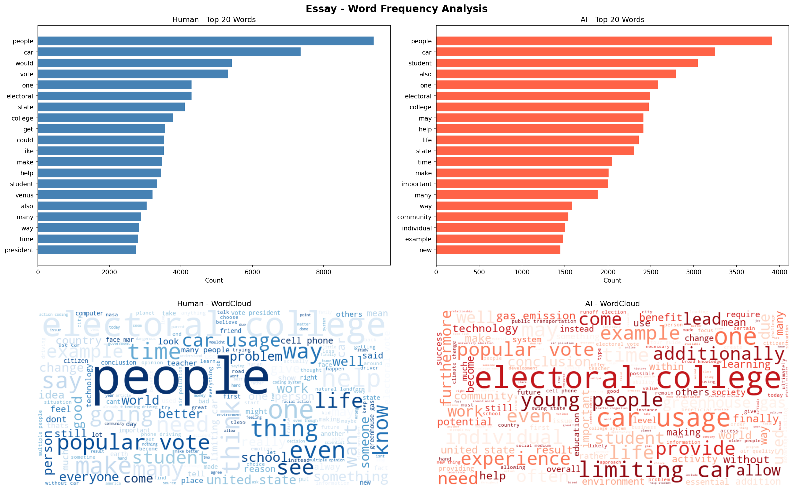
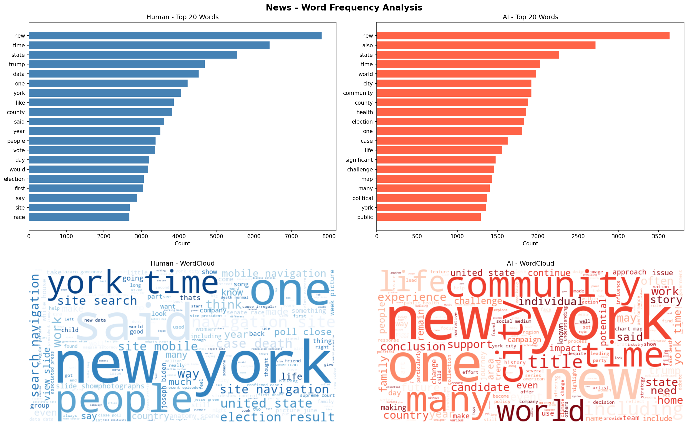
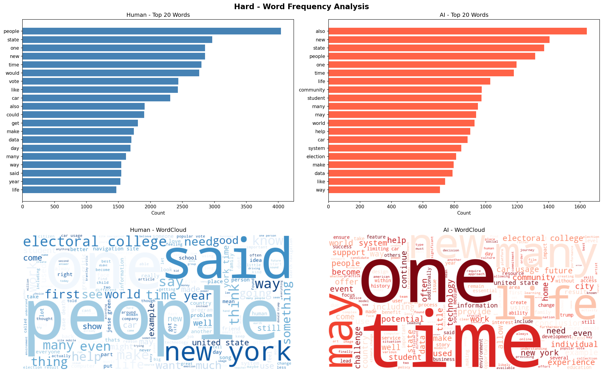
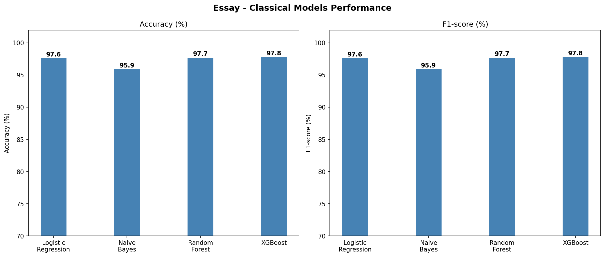
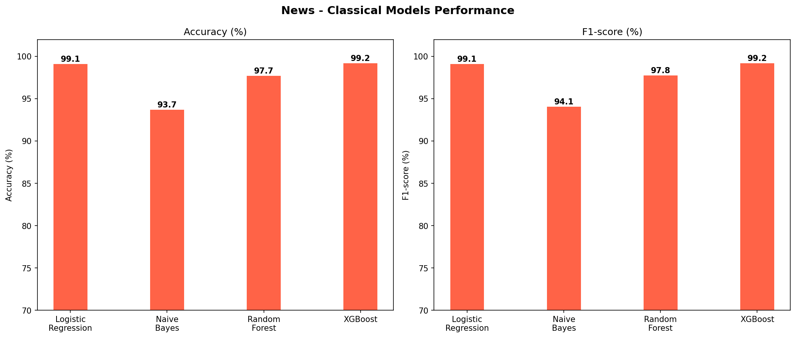
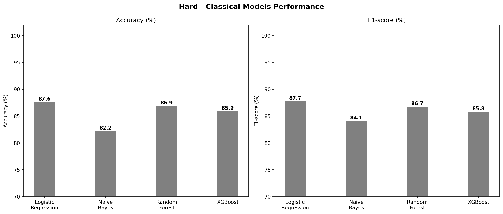
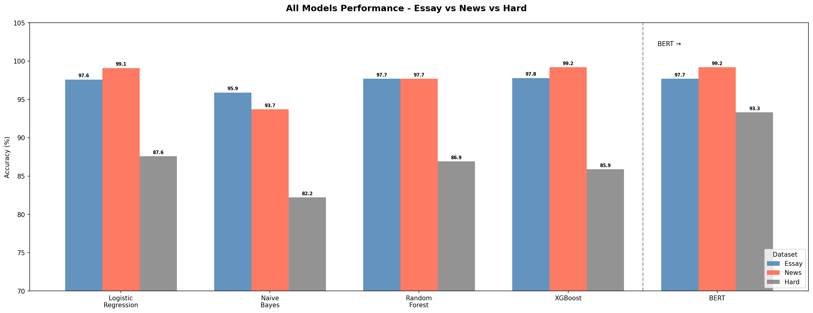

# AI-X_ai-generated-text-detection

## Title: AI 생성 콘텐츠 탐지 모델 비교 분석  
### AI 글·뉴스를 머신러닝으로 구분할 수 있을까?


## Members and Team Contribution
```
김희연, 2023073081
손승한, 2024020891
우지욱, 2023025969
임준형, 2023060955
```

- 희연: Analyzed the model performance results, explained why BERT performed strongly on the Hard dataset, summarized the limitations and future work, and participated in video recording.
  
- 승한: Explained the purpose of using TF-IDF, Logistic Regression, Naive Bayes, Random Forest, XGBoost, and BERT in the AI-generated text classification process.

- 지욱: Developed the project topic, designed the overall GitHub blog structure, and established the basic experimental framework, including the distinction between the main experiment and the additional experiment.

- 준형: Described the Essay, News, and Hard datasets, defined the label structure, explained the preprocessing steps and their purposes, and interpreted the visualizations and performance tables.
  

본 프로젝트에서는 GitHub 블로그 작성과 설명 정리에 생성형 AI 도구를 일부 활용하였다. 
그러나 코드, 알고리즘, 실험 설계, 결과 해석은 팀원들이 직접 검토하고 이해한 내용을 바탕으로 정리하였다.

특히 단순히 결과를 제시하는 것이 아니라, 왜 해당 전처리 과정을 적용했는지, 왜 특정 알고리즘을 선택했는지, 왜 Accuracy와 F1-score를 함께 사용했는지, 
그리고 Essay, News, Hard dataset을 각각 어떻게 해석해야 하는지를 팀원별로 나누어 설명하였다.


## Project Overview

최근 ChatGPT와 같은 생성형 AI가 글쓰기, 뉴스 작성, 과제물 작성 등 다양한 영역에서 활용되면서 AI가 작성한 텍스트와 사람이 작성한 텍스트를 구분하는 문제가 중요해지고 있다.

본 프로젝트는 AI-generated text와 human-written text를 구분하는 머신러닝 모델을 구현하고, Essay와 News라는 서로 다른 장르에서 AI 탐지 모델이 얼마나 안정적으로 작동하는지 비교하는 것을 목표로 한다.

특히 Essay와 News 데이터는 문체적 특성이 다르기 때문에, 두 데이터를 하나로 합치지 않고 각각 독립적인 분류 문제로 설계하였다.


## Research Questions

본 프로젝트에서는 단순히 AI-generated text와 human-written text를 구분하는 데서 끝나지 않고, 
데이터의 장르와 난이도에 따라 모델 성능이 어떻게 달라지는지를 함께 확인하고자 하였다. 
이를 위해 Essay와 News를 main experiment로 설정하고, Hard dataset을 additional experiment로 분리하였다.

본 프로젝트의 연구 질문은 다음과 같다.

1. TF-IDF 기반 머신러닝 모델은 Essay 데이터에서 AI-generated text와 human-written text를 효과적으로 구분할 수 있는가?
2. 같은 방식의 모델은 News 데이터에서도 안정적으로 작동하는가?
3. Essay와 News 중 어떤 장르에서 AI-generated text detection이 더 쉬운가?
4. 장르가 달라졌을 때 가장 높은 성능을 보이는 알고리즘도 달라지는가?
5. Logistic Regression, Naive Bayes, Random Forest, XGBoost와 같은 고전 머신러닝 모델은 BERT 기반 모델과 비교했을 때 어느 정도의 성능을 보이는가?
6. Hard dataset처럼 단어 빈도만으로 구분하기 어려운 데이터에서는 고전 머신러닝 모델의 성능이 얼마나 낮아지는가?
7. BERT는 Hard dataset에서 문맥 정보를 활용하여 고전 모델보다 더 안정적인 성능을 보이는가?


## Dataset

본 프로젝트에서는 Essay와 News 데이터를 중심 데이터셋으로 사용하였다. 
각 데이터셋은 사람이 작성한 텍스트와 AI가 생성한 텍스트로 구성되어 있다.

| Dataset | Human-written | AI-generated | Total | Usage |
|---|---:|---:|---:|---|
| Essay | 2,500 | 2,500 | 5,000 | Main Experiment |
| News | 2,500 | 2,500 | 5,000 | Main Experiment |
| Hard | - | - | - | Additional Experiment |

Label은 다음과 같이 정의하였다.

| Label | Meaning |
|---|---|
| 0 | Human-written text |
| 1 | AI-generated text |

Essay와 News 데이터는 장르별 AI 탐지 성능을 비교하기 위한 핵심 데이터셋으로 사용하였다.  
Hard dataset은 모델이 더 어려운 조건에서도 안정적으로 작동하는지 확인하기 위한 추가 실험 데이터셋으로 활용하였다.


## Project Design

본 프로젝트에서는 실험을 설계할 때 가장 먼저 “데이터를 하나로 합칠 것인가, 아니면 장르별로 나누어 볼 것인가”를 고민하였다. 
Essay와 News는 모두 영어 텍스트이고, AI-generated text와 human-written text를 포함하고 있다는 점에서는 비슷하다. 
그러나 두 데이터는 글이 쓰이는 목적과 문체가 다르다.

Essay는 개인의 경험, 주장, 감정 표현, 연결어 사용 등이 비교적 많이 나타나는 글이다. 
반면 News는 사건이나 정보를 객관적으로 전달하는 글이며, 형식적이고 보도 기사에 가까운 문장 구조를 가지는 경우가 많다. 
따라서 Essay와 News를 하나의 데이터셋으로 합쳐 학습할 경우, 
모델이 AI 생성 여부를 학습한다기보다 Essay와 News의 장르 차이를 먼저 학습할 가능성이 있다고 판단하였다.

이를 방지하기 위해 본 프로젝트에서는 Essay와 News를 각각 독립적인 main experiment로 설정하였다. 
즉, Essay 데이터로는 Essay AI Detection Model을 학습하고, News 데이터로는 News AI Detection Model을 따로 학습하였다. 
두 데이터셋에는 동일한 전처리 방식, 동일한 TF-IDF 설정, 동일한 모델들을 적용하였다. 
이렇게 설계하면 분석 절차는 같게 유지하면서도, 장르에 따라 AI 탐지 성능이 어떻게 달라지는지 비교할 수 있다.

또한 Hard dataset은 main experiment와 구분하여 additional experiment로 사용하였다. 
Hard dataset은 Essay나 News처럼 특정 장르의 성능을 비교하기 위한 데이터라기보다, 더 어려운 조건에서 모델이 얼마나 안정적으로 작동하는지 확인하기 위한 데이터로 보았다. 
실제로 Hard dataset에서는 Human text와 AI text가 비슷한 단어를 공유하는 경우가 많아, 단순한 단어 빈도 차이만으로는 두 클래스를 구분하기 어렵다.

따라서 Hard dataset의 결과는 Essay와 News의 장르별 비교 결과와 동일한 의미로 직접 비교하기보다는, 
TF-IDF 기반 고전 머신러닝 모델의 한계와 BERT 기반 모델의 장점을 확인하기 위한 추가 실험으로 해석하였다. 
이 구분을 통해 프로젝트의 중심 주제인 Essay와 News의 장르별 비교를 유지하면서도, 더 어려운 데이터 환경에서 모델 성능이 어떻게 변화하는지 함께 확인할 수 있었다.


| Experiment Type | Dataset | Purpose | Main Question |
|---|---|---|---|
| Main Experiment | Essay | 개인의 주장과 경험이 포함된 글에서 AI text를 탐지할 수 있는지 확인 | Essay 장르에서도 TF-IDF 기반 모델이 효과적인가? |
| Main Experiment | News | 객관적이고 형식적인 뉴스 문체에서 AI text를 탐지할 수 있는지 확인 | News 장르에서는 어떤 모델이 가장 안정적으로 작동하는가? |
| Additional Experiment | Hard | 단어 빈도만으로 구분하기 어려운 데이터에서 모델 성능 확인 | 어려운 조건에서 BERT가 고전 모델보다 강한가? |


정리하면, Essay와 News는 장르별 AI 탐지 성능을 비교하기 위한 핵심 실험이고, Hard dataset은 더 어려운 조건에서 모델의 일반화 가능성을 확인하기 위한 추가 실험이다.


## Methodology

전체 분석 과정은 다음과 같다.

1. Dataset loading
2. Text preprocessing
3. Word frequency analysis
4. TF-IDF vectorization
5. Classical machine learning model training
6. BERT-based model training
7. Model performance comparison
8. Result visualization


## Text Preprocessing

텍스트 데이터는 모델 학습에 적합하도록 다음과 같은 전처리 과정을 거쳤다.

- 결측치 제거
- Label 값 정리
- 소문자 변환
- 특수문자 제거
- 불용어 제거
- Lemmatization
- 너무 짧은 텍스트 제거

전처리 후 생성된 텍스트는 `clean_text` 컬럼에 저장하였다.

## Models

본 프로젝트에서는 고전 머신러닝 모델과 BERT 기반 모델을 함께 사용하였다.

```
Classical Machine Learning Models

- Logistic Regression
- Naive Bayes
- Random Forest
- XGBoost

Transformer-based Model

- DistilBERT

고전 머신러닝 모델은 TF-IDF로 변환된 텍스트 벡터를 입력으로 사용하였다.  
BERT 모델은 문맥 정보를 반영할 수 있는 Transformer 기반 모델로, 단어 빈도 중심의 고전 모델과 비교하기 위해 사용하였다.
```

## Evaluation Metrics

모델 성능은 다음 지표를 기준으로 평가하였다.

| Metric | Description |
|---|---|
| Accuracy | 전체 데이터 중 모델이 올바르게 예측한 비율 |
| F1-score | Precision과 Recall의 균형을 고려한 성능 지표 |

Accuracy는 전체적인 분류 정확도를 보여주고, F1-score는 AI 텍스트와 Human 텍스트를 균형 있게 분류하는지 확인하는 데 사용하였다.


## Repository Structure

```text
AI-X_ai-generated-text-detection/
├── README.md
├── data/
│   ├── README.md
│   ├── project_dataset/
│   │   ├── essay_dataset.csv
│   │   ├── news_dataset.csv
│   │   └── hard_dataset.csv
│   └── processed/
│       ├── essay_clean_dataset.csv
│       └── news_clean_dataset.csv
├── notebooks/
│   ├── README.md
│   └── human_vs_ai_text_classification.py
├── results/
│   ├── figures/
│   │   ├── essay_words.png
│   │   ├── news_words.png
│   │   ├── hard_words.png
│   │   ├── essay_classical.png
│   │   ├── news_classical.png
│   │   ├── hard_classical.png
│   │   └── final_all_models.png
│   └── tables/
│       └── final_results.csv
├── src/
└── requirements.txt
```

## How to Run

프로젝트 실행을 위해 먼저 필요한 라이브러리를 설치한다.

```bash
pip install -r requirements.txt
```

그다음 메인 Python 파일을 실행한다.

```bash
python notebooks/human_vs_ai_text_classification.py
```

메인 코드는 Essay, News, Hard dataset을 불러와 전처리, 시각화, 모델 학습, 성능 비교를 순서대로 수행한다.


## Expected Output

코드를 실행하면 전처리된 데이터, 시각화 이미지, 최종 결과표가 생성된다.

```text
data/
└── processed/
    ├── essay_clean_dataset.csv
    ├── news_clean_dataset.csv
    └── hard_clean_dataset.csv

results/
├── figures/
│   ├── essay_words.png
│   ├── news_words.png
│   ├── hard_words.png
│   ├── essay_classical.png
│   ├── news_classical.png
│   ├── hard_classical.png
│   └── final_all_models.png
└── tables/
    └── final_results.csv
```

일부 전처리 데이터 파일은 용량 제한으로 인해 GitHub에 업로드하지 않을 수 있다. 이 경우에도 메인 코드를 실행하면 동일한 파일을 다시 생성할 수 있다.


## Results Summary
아래 결과는 main experiment와 additional experiment를 구분하여 해석하였다. 
Essay와 News는 동일한 조건에서 장르별 성능 차이를 확인하기 위한 결과이고, Hard dataset은 더 어려운 조건에서 모델의 한계를 확인하기 위한 결과이다. 
따라서 세 데이터셋의 정확도를 단순히 나란히 비교하기보다는, 각 데이터셋이 실험에서 어떤 역할을 하는지에 따라 해석하는 것이 중요하다.

첫 번째는 Essay와 News 데이터를 활용한 main experiment이다.  
두 번째는 더 어려운 조건의 Hard dataset을 활용한 additional experiment이다.

### Main Experiment: Essay vs News

Essay와 News 데이터에 대해 각각 독립적인 AI text detection model을 학습하였다. 두 데이터셋은 하나로 합치지 않고, 장르별 특성을 비교하기 위해 따로 분석하였다.

| Model | Essay Accuracy | News Accuracy |
|---|---:|---:|
| Logistic Regression | 97.6% | 99.1% |
| Naive Bayes | 95.9% | 93.7% |
| Random Forest | 97.7% | 97.7% |
| XGBoost | 97.8% | 99.2% |
| BERT | 97.7% | 99.2% |

Essay와 News 데이터에서는 대부분의 모델이 높은 성능을 보였다. 특히 News 데이터에서는 XGBoost와 BERT가 99.2%의 정확도를 기록하며 가장 높은 성능을 보였다.

Main experiment에서는 Essay와 News 데이터를 각각 독립적으로 학습하였다. 
두 데이터를 하나로 합치지 않은 이유는 모델이 AI 생성 여부가 아니라 장르 차이를 학습하는 상황을 피하기 위해서이다. 
예를 들어 News 데이터에는 특정 인물명, 지명, 인용 표현처럼 기사에서 자주 등장하는 단어가 많고, Essay 데이터에는 개인의 생각이나 주장을 표현하는 단어가 많이 등장한다. 이
러한 장르적 차이가 너무 크면, 모델이 “AI인지 Human인지”보다 “Essay인지 News인지”를 먼저 구분할 가능성이 있다.


따라서 본 프로젝트에서는 Essay와 News를 각각 별도의 이진 분류 문제로 다루었다. 
각 데이터셋에서 label은 동일하게 `0 = Human-written text`, `1 = AI-generated text`로 설정하였고, 전처리 방식과 모델링 방식도 동일하게 적용하였다. 
이렇게 하면 장르별 조건은 다르지만, 분석 절차는 동일하게 유지되므로 두 데이터셋의 성능 차이를 더 공정하게 비교할 수 있다.


### Additional Experiment: Hard Dataset

Hard dataset은 main experiment의 결과를 보완하기 위한 additional experiment로 사용하였다. 
Essay와 News에서는 Human text와 AI text의 단어 사용 패턴이 비교적 뚜렷하게 달랐기 때문에, TF-IDF 기반 고전 모델도 높은 성능을 보일 수 있었다. 
그러나 실제 환경에서는 AI가 작성한 글이 항상 쉽게 구분되는 것은 아니다. 사람이 쓴 글과 비슷한 단어를 사용하거나, 문장 구조가 자연스럽게 구성된 AI text도 존재할 수 있다.

이러한 상황을 고려하여 Hard dataset을 추가 실험으로 활용하였다. 
Hard dataset에서는 Human과 AI가 공유하는 단어가 많고, 단순히 특정 단어가 많이 등장하는지만으로는 두 클래스를 구분하기 어렵다. 
따라서 이 실험은 단어 빈도 기반 모델의 한계를 확인하고, 문맥 정보를 반영하는 BERT 기반 모델이 실제로 더 어려운 조건에서 강점을 보이는지 확인하는 데 목적이 있다.

다만 Hard dataset은 Essay와 News처럼 장르 비교를 위한 핵심 데이터셋은 아니다. 
데이터 구성 방식과 난이도 자체가 다르기 때문에, Hard의 결과를 Essay나 News와 동일한 기준으로 직접 비교하기보다는 모델의 robustness를 확인하는 보조 실험으로 해석하였다.


| Model | Hard Accuracy |
|---|---:|
| Logistic Regression | 87.6% |
| Naive Bayes | 82.2% |
| Random Forest | 86.9% |
| XGBoost | 85.9% |
| BERT | 93.3% |

Hard dataset에서는 고전 머신러닝 모델의 성능이 Essay와 News에 비해 낮아졌다. 반면 BERT는 93.3%의 정확도를 보여, 더 어려운 데이터 환경에서 문맥 정보를 반영하는 Transformer 기반 모델의 강점이 나타났다.


## Visualization

### Word Frequency Analysis

Human-written text와 AI-generated text에서 자주 등장하는 단어를 비교하였다.
우리가 Word Frequency Analysis를 수행한 건 단순히 시각화를 위해서가 아니다.
모델을 학습하기 전에 "TF-IDF 기반 접근이 이 데이터에서 실제로 유효한가" 를 먼저 검증해야 했기 때문이다.
TF-IDF란?
TF-IDF는 Term Frequency - Inverse Document Frequency의 약자로, 텍스트를 숫자 벡터로 변환하는 방법이다. 두 가지 개념을 결합한다.

TF (Term Frequency) : 특정 문서 안에서 어떤 단어가 얼마나 자주 등장하는지. 많이 나올수록 높은 값.
IDF (Inverse Document Frequency) : 전체 문서 중에서 그 단어가 얼마나 흔한지. 여러 문서에서 공통적으로 나오는 단어일수록 낮은 값.

둘을 곱하면 "특정 문서에서 자주 나오지만, 전체 문서에서는 흔하지 않은 단어" 에 높은 가중치가 부여된다.
예를 들어 the, is, and 같은 단어는 모든 문서에서 공통적으로 등장하기 때문에 IDF가 낮아 TF-IDF 값이 낮다. 
반면 electoral처럼 AI Essay 텍스트에서 집중적으로 나오는 단어는 TF-IDF 값이 높아진다. 
이렇게 클래스를 구분하는 데 실질적으로 유용한 단어에만 높은 가중치를 주는 것이 TF-IDF의 핵심이다.
따라서 Human과 AI의 단어 사용 패턴이 뚜렷하게 다를수록 TF-IDF 벡터가 두 클래스를 잘 분리할 수 있다는 의미가 된다. 
반대로 단어 분포가 거의 동일하다면, TF-IDF 기반 접근 자체를 재검토해야 한다.


#### Essay Dataset


Essay 데이터에서 Human의 Top 20 단어를 보면 people, car, would, vote, venus, could, like, get 등 구어체적이고 개인적인 표현이 많이 등장한다. 
특히 venus나 like, get처럼 비형식적인 단어가 포함된 점이 눈에 띈다. Human WordCloud에서도 people, way, life, better, thing, see, even 같은 일상적인 단어들이 크게 나타난다.
반면 AI의 Top 20 단어에는 important, community, individual, example, may, help, provide가 등장하고, 
AI WordCloud에서는 additionally, furthermore, electoral college, limiting, provide, experience, young 같은 단어가 두드러진다.

이 차이는 명확하다. Human은 구어체와 개인적 경험 중심의 어휘를 쓰는 반면, AI는 논리적 흐름을 강조하는 연결어(additionally, furthermore)와 격식체 표현을 반복적으로 사용하는 경향이 있다. 
TF-IDF 입장에서 이 패턴 차이는 두 클래스를 구분하는 충분한 신호가 되고, 이것이 Essay에서 고전 모델들이 95~98% 수준의 높은 성능을 보인 근거가 된다.


#### News Dataset



News Human 데이터에서는 new, time, state, trump, data, york, said, county, race 등 실제 사건 기반의 구체적인 고유명사와 인용 표현이 상위에 등장한다. 
Human WordCloud를 보면 new york, people, said, election result, united state, site navigation 등 실제 보도 기사 특유의 어휘가 강하게 나타난다.
반면 AI News의 Top 20에는 also, community, significant, challenge, political, public, health, individual이 등장한다. 
AI WordCloud에서는 community, individual, new york, one, many, world 등이 크게 보이는데, 뉴스 형식을 흉내내되 구체적인 사건명이나 고유명사 없이 일반적인 설명 위주로 작성된 특징이 나타난다.
Human 뉴스에는 trump, york, said, race처럼 실제 보도 특유의 어휘가 강하게 등장하는 반면, 
AI 생성 뉴스에는 이러한 구체적 고유명사가 거의 없고 community, significant, challenge 같은 일반적 단어가 상대적으로 더 많이 쓰인다. 
TF-IDF 입장에서 이 차이는 Essay보다 훨씬 뚜렷한 분리 신호가 되기 때문에, News에서 고전 모델 성능이 Essay보다 전반적으로 더 높게 나온 것으로 해석할 수 있다.


#### Hard Dataset


Hard 데이터에서는 앞의 두 데이터셋과 가장 다른 양상이 나타난다.
Human Top 20에는 people, state, one, new, time, would, vote, like, car, said가 등장하고, 
AI Top 20에는 also, new, state, people, one, time, life, community, student, may가 등장한다.

people, state, one, new, time이 양쪽 모두의 상위권에 겹쳐서 등장한다. 
Human WordCloud에서는 people, said, new york, electoral college, first, world가 크게 보이고, 
AI WordCloud에서는 one, time, may, new york, community, life, experience가 크게 나타난다.

Essay나 News에서는 Human과 AI의 핵심 단어가 상당히 달라서 TF-IDF가 명확한 경계를 학습할 수 있었다. 
반면 Hard에서는 양쪽이 비슷한 단어를 공유하며, 차이는 어떤 단어를 얼마나 자주 쓰느냐의 미묘한 빈도 차이와 그 단어들이 문장 안에서 어떤 맥락으로 배치되느냐에 있다. 
이 구조적 차이가 Hard에서 고전 모델들의 성능이 제한된 핵심 이유다.


### Classical Model Performance

각 데이터셋에 대해 TF-IDF 기반 고전 머신러닝 모델의 Accuracy와 F1-score를 비교하였다.


#### Essay Dataset


그래프에서 볼 수 있듯 Accuracy와 F1-score가 동일한 수치를 보인다. 
이는 모델이 Human과 AI 텍스트를 균형 있게 잘 분류하고 있다는 의미다. 

특히 XGBoost가 97.8%로 가장 높은 성능을 보였고, Naive Bayes가 95.9%로 가장 낮았다.
Naive Bayes가 상대적으로 낮은 이유는 구조적으로 설명할 수 있다. 
Naive Bayes는 각 단어가 서로 독립적이라고 가정(Naive 가정)하고 등장 확률만으로 분류한다. 그
런데 실제 텍스트에서 단어들은 독립적이지 않다. electoral과 college는 함께 등장하는 경우가 많고, additionally와 furthermore도 AI 텍스트에서 패턴을 이루며 나타난다. 
코드에서 ngram_range=(1,2)로 bigram까지 포함했지만, Naive Bayes의 독립 가정이 이러한 단어 간 관계를 온전히 반영하지 못하는 한계가 있다.


#### News Dataset


News에서는 Logistic Regression과 XGBoost가 각각 99.1%, 99.2%로 Essay보다 높은 성능을 보였다. 
앞서 Word Frequency 분석에서 확인했듯, News 데이터는 Human과 AI의 어휘 차이가 Essay보다 더 뚜렷하기 때문이다.

흥미로운 점은 Naive Bayes가 News에서 93.7%로 Essay(95.9%)보다 오히려 낮아졌다는 것이다. 
News Human 텍스트에는 trump, york, said, race 같은 특정 고유명사가 집중적으로 등장하는데, 
Naive Bayes는 이러한 단어들의 등장 확률을 독립적으로 처리하다 보니 단어 간 조합 패턴을 충분히 활용하지 못한 것으로 해석할 수 있다.


#### Hard Dataset


Hard에서는 모든 고전 모델이 82~88% 수준으로 성능이 눈에 띄게 낮아졌다. 
특히 Essay/News와 달리 Accuracy와 F1-score 사이에 미세한 차이가 나타나기 시작한다. 
Naive Bayes의 경우 Accuracy 82.2% 대비 F1-score가 84.08%로 오히려 높은데, 이는 모델이 특정 클래스(AI)를 더 잘 맞추고 다른 클래스(Human)를 덜 맞추는 불균형한 예측 패턴이 생겼음을 시사한다.

또한 흥미롭게도 Hard에서는 강력한 앙상블 모델인 XGBoost(85.9%)가 단순한 Logistic Regression(87.6%)보다 낮은 성능을 보였다. 
이는 XGBoost가 Essay/News에서 학습한 복잡한 단어 패턴이 Hard 데이터의 분포와 맞지 않아 오히려 과적합된 방향으로 작동했을 가능성을 보여준다.


### Final Model Comparison

Essay, News, Hard dataset에 대해 고전 머신러닝 모델과 BERT 모델의 성능을 최종 비교하였다.



그래프에서 BERT 영역을 구분하는 점선(----)이 의도적으로 삽입되어 있다. 
이 점선의 왼쪽, 즉 고전 모델 4개 구간에서는 세 데이터셋(파란색 Essay, 빨간색 News, 회색 Hard)의 막대 높이 차이가 모든 모델에서 일관되게 나타난다. 
특히 Hard(회색)가 항상 가장 낮고, 고전 모델들 사이의 Hard 성능 차이는 크지 않다(82.2~87.6%).
반면 점선 오른쪽 BERT 영역에서는 양상이 달라진다. 
Essay와 News의 성능(97.7%, 99.2%)은 고전 모델 최고치와 거의 같은 수준이지만, Hard의 성능(93.3%)이 고전 모델 Hard 최고치(87.6%)보다 5.7%p나 높아진다. 이것이 이번 실험의 핵심 발견이다. 

Hard에서 고전 모델 성능이 떨어진 이유는 다음과 같다.
고전 모델들이 사용하는 TF-IDF는 ngram_range=(1,2), max_features=10000으로 설정되어 있어 단어와 bigram의 빈도를 기반으로 벡터를 만든다. 
이 방식은 각 단어(또는 단어 쌍)를 독립적인 feature로 취급하고, 단어들이 문장 안에서 어떤 순서와 맥락으로 배치되는지는 반영하지 못한다.

Hard 데이터에서 AI 텍스트는 단어 선택 자체보다는 문장의 흐름, 논리 전개 방식, 특정 표현 패턴의 반복 등 문맥 수준의 특징으로 Human과 구별된다. 
Word Frequency 분석에서 확인했듯, 양쪽이 people, state, one, new, time 같은 단어를 공통으로 사용하기 때문에, 단어 빈도만 보는 TF-IDF 기반 모델로는 두 클래스를 뚜렷하게 분리하기 어렵다.

반면에 Hard에서 BERT가 강했던 이유는 다음과 같다.
BERT(이 프로젝트에서는 DistilBERT 사용)는 구조적으로 고전 모델과 근본적으로 다른 방식으로 텍스트를 처리한다.
TF-IDF가 "단어가 몇 번 나왔는가"를 세는 방식이라면, BERT는 Transformer의 Self-Attention 메커니즘을 통해 "이 단어가 문장 안의 다른 단어들과 어떤 관계에 있는가" 를 계산한다.
예를 들어 "may provide significant support to the community" 라는 표현이 있을 때, TF-IDF는 may, provide, significant, support, community를 각각 독립적인 feature로 처리한다. 
반면 BERT는 Self-Attention을 통해 may가 provide와, significant가 support와 어떤 관계를 가지는지를 계산하고, 이 단어들이 함께 등장하는 패턴을 하나의 문맥 벡터로 인코딩한다.

또한 코드를 보면 BERT 학습 시 원본 text 컬럼을 사용하고, 고전 모델이 사용하는 전처리된 clean_text를 사용하지 않는다. 이는 의도적인 설계다. 
불용어를 제거하고 lemmatization을 적용한 clean_text는 TF-IDF처럼 단어 빈도를 세는 모델에는 적합하지만, BERT는 원문 그대로의 문장 구조와 문법적 흐름까지 활용할 수 있기 때문이다.
Hard 데이터에서 AI 텍스트는 단어 하나하나로 보면 Human과 비슷하지만, 문장을 이어가는 방식과 논증 구조가 반복적이고 규칙적인 특징을 보인다. 
BERT의 Self-Attention은 이러한 문장 내 단어 간 관계와 위치 정보를 함께 학습하기 때문에, 단어 빈도로는 잡히지 않는 이러한 문체적 패턴을 포착할 수 있다.
이것이 Hard에서 BERT가 Accuracy 93.3%, F1-score 93.64%로 고전 모델 최고치인 Logistic Regression(87.6%, F1 87.75%)보다 약 5.7~6%p 높은 성능을 보인 이유다.

또한 News 데이터에서 Logistic Regression 99.1%, XGBoost 99.2%, BERT 99.2%라는 높은 성능이 나왔는데, 그 이유는 이미 Word Frequency 분석에서 알 수 있다.
뉴스 기사는 사건 기반으로 작성되기 때문에, 인간 기자가 쓴 글에는 특정 인물명(trump), 지명(york), 인용 표현(said), 지역명(county) 같은 구체적 어휘가 고밀도로 나타난다. 
반면 AI가 뉴스 형식으로 글을 작성할 때는 이러한 구체적 어휘보다 community, significant, challenge, public처럼 포괄적이고 중립적인 단어를 선택하는 경향이 있다.
TF-IDF는 "특정 클래스에서만 집중적으로 나타나는 단어"를 포착하는 데 강하다. 
News Human 텍스트의 trump, said, race는 AI 텍스트에서는 거의 등장하지 않기 때문에, TF-IDF 벡터 공간에서 두 클래스가 매우 명확하게 분리된다. 
이 뚜렷한 어휘 분리가 News에서 가장 높은 성능이 나온 핵심 이유다.


## Conclusion

본 프로젝트는 Essay와 News라는 서로 다른 장르에서 AI 생성 텍스트를 탐지하는 머신러닝 모델을 구현하고, 
TF-IDF 기반 고전 모델 4개(Logistic Regression, Naive Bayes, Random Forest, XGBoost)와 Transformer 기반 DistilBERT의 성능을 비교하였다.

실험의 핵심 설계 원칙은 Essay와 News 데이터를 하나로 합치지 않고 독립적인 분류 문제로 처리한 것이다. 
두 장르를 합쳐 학습했다면 모델이 AI 생성 여부가 아니라 장르 차이를 학습했을 가능성이 크기 때문이다. 이 설계 판단이 프로젝트 전반의 실험 신뢰성을 높이는 데 중요한 역할을 했다.

실험 결과를 종합하면 세 가지 결론을 도출할 수 있다.

첫째, Essay와 News처럼 Human과 AI의 단어 사용 패턴 차이가 명확한 데이터에서는 TF-IDF 기반 고전 머신러닝 모델만으로도 95~99% 수준의 높은 탐지 성능을 달성할 수 있다. 
이는 모든 상황에서 복잡한 딥러닝 모델이 필요하지는 않음을 시사한다.

둘째, 단어 빈도 패턴만으로는 구분하기 어려운 Hard dataset에서는 고전 모델의 성능이 82~88%로 제한된 반면, 문맥 정보를 활용하는 BERT는 93.3%를 기록하며 명확한 성능 우위를 보였다. 
AI 생성 텍스트의 정교함이 높아질수록 문맥 기반 모델의 필요성이 커진다는 것을 실험적으로 확인한 셈이다.

셋째, 데이터의 장르와 난이도가 모델 선택에 결정적인 영향을 미친다. 
탐지 시스템을 설계할 때는 어떤 장르의 텍스트를 대상으로 하는지, 얼마나 정교한 AI 생성 텍스트를 다루는지에 따라 적합한 알고리즘을 선택해야 한다.

결론적으로, AI 생성 텍스트 탐지 문제는 단순히 "AI가 쓴 글을 잡아내는 것"이 아니라, 데이터의 특성을 이해하고 그에 맞는 표현 방식과 모델을 선택하는 문제임을 이번 프로젝트를 통해 확인하였다.


## Limitations

본 프로젝트에는 다음과 같은 한계가 있다.

1. 데이터셋의 장르 편향
Essay와 News 두 장르에 국한된 실험이기 때문에, 결과를 모든 텍스트 유형으로 일반화하기 어렵다. Blog, SNS 게시글, 학술 논문, 리뷰 등 다양한 장르에서의 성능은 별도로 검증이 필요하다.

2. 특정 생성 모델에 대한 과적합 가능성
AI 생성 텍스트가 특정 LLM의 데이터로만 구성되어 있다면, 해당 모델의 문체적 특성에 편향되어 Claude, Gemini, LLaMA 등 다른 LLM이 생성한 텍스트에는 성능이 낮아질 수 있다.

3. BERT와 고전 모델의 학습 조건 불일치
코드에서 Light Version 기준으로 BERT는 sample_n=1000, epochs=2로 학습되었다. 반면 고전 모델은 전체 데이터셋(약 5,000개)을 사용했다. 즉 학습 조건이 동일하지 않기 때문에, BERT와 고전 모델의 성능 차이를 순수하게 알고리즘의 차이로만 해석하기에는 주의가 필요하다. 만약 BERT도 전체 샘플로 더 많은 epoch을 학습했다면 Hard에서의 성능 차이는 더 컸을 가능성이 있다.

4. 텍스트 길이 변수
BERT는 max_length=128로 토큰을 잘라내기 때문에, 긴 텍스트에서는 뒷부분 정보가 손실된다. 텍스트 길이 분포 차이가 성능에 영향을 미쳤을 가능성이 있다.

5. Hard dataset의 실험 조건 차이
Hard dataset은 Essay/News main experiment와 완전히 동일한 조건의 실험이 아니다. 데이터 구성 방식과 난이도 기준이 다르기 때문에, Essay/News 결과와 직접 비교하여 해석하는 데는 주의가 필요하다.


## Future Work

향후 연구에서는 다음과 같은 방향으로 확장할 수 있다.

1. Cross-domain evaluation
Essay에서 학습한 모델을 News에 적용하고, 반대로 News에서 학습한 모델을 Essay에 적용하는 실험을 수행하면, 모델이 단순히 장르 특성을 외운 것인지 아니면 AI 생성 텍스트의 본질적인 패턴을 학습한 것인지 검증할 수 있다. 이는 모델의 실제 일반화 능력을 측정하는 핵심 실험이다.

2. 다양한 LLM 생성 텍스트 비교
GPT 계열 외에도 Claude, Gemini, LLaMA, Mistral 등 다양한 모델로 생성한 텍스트를 각각 포함하여 실험하면, 특정 모델의 문체에 편향되지 않은 더 일반화된 탐지 모델을 만들 수 있다.

3. 더 다양한 장르 확장
Blog, 소셜미디어 게시글, 학술 논문 초록 등 다양한 장르에서의 실험이 필요하다. 특히 소셜미디어처럼 짧고 비형식적인 텍스트에서 현재 모델이 어떻게 동작하는지는 별도 검증이 필요하다.

4. 오분류 사례 분석 (Error Analysis)
어떤 Human 텍스트가 AI로 오분류되었는지, 어떤 AI 텍스트가 Human으로 오분류되었는지를 분석하면 모델의 실질적인 한계와 개선 방향을 보다 구체적으로 파악할 수 있다.

5. 한국어 텍스트로의 확장
현재 프로젝트는 영어 텍스트 기반이다. 한국어 AI 생성 텍스트 탐지는 KoBERT 등 한국어 특화 모델을 활용하여 별도 실험이 필요하며, 한국어 특유의 형태소 처리가 전처리 설계에서 추가로 고려되어야 한다.


## References

- scikit-learn documentation
- XGBoost documentation
- Hugging Face Transformers documentation
- NLTK documentation
